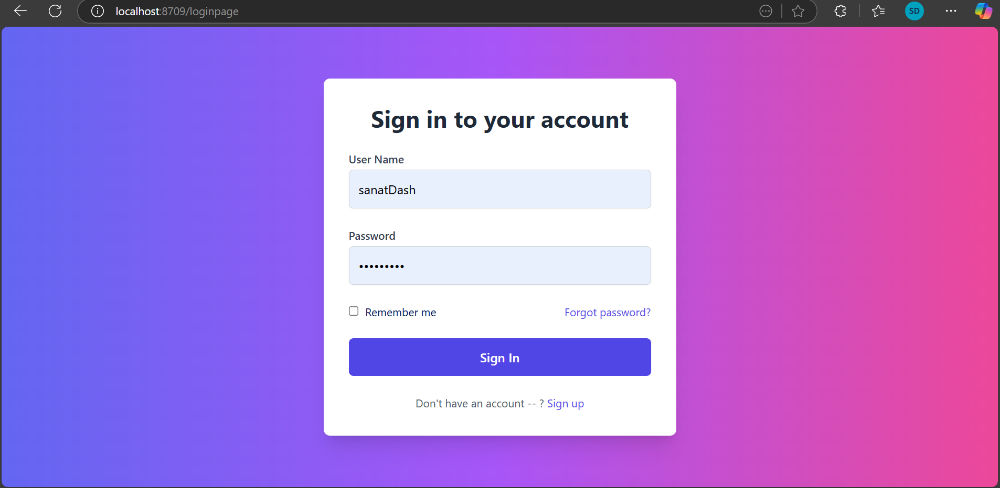
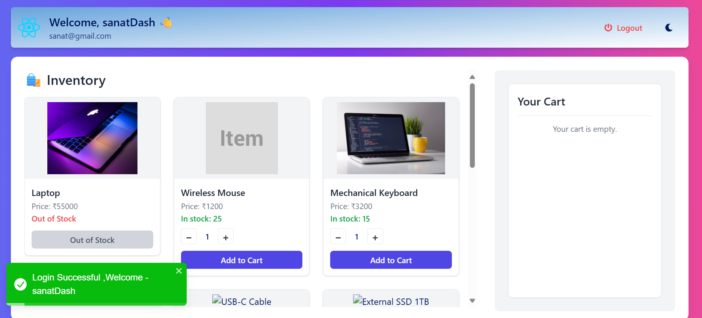
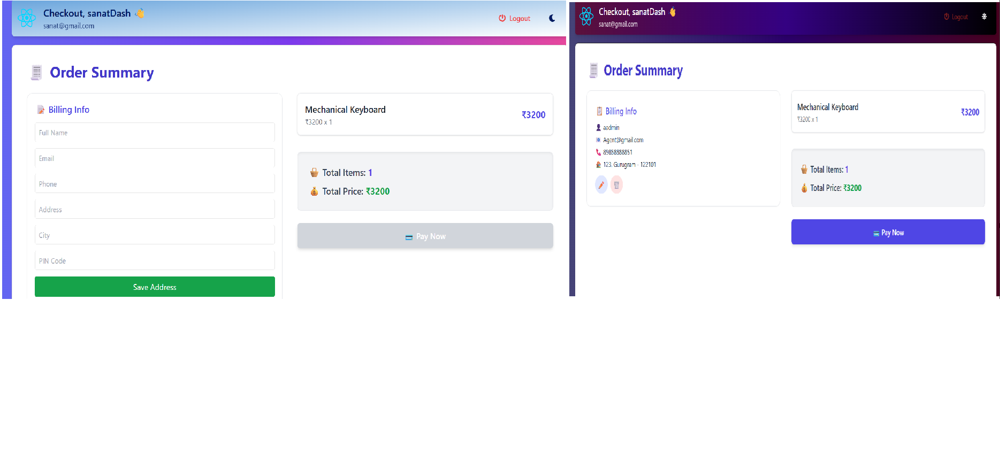
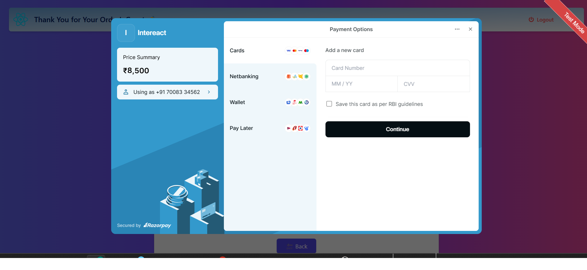
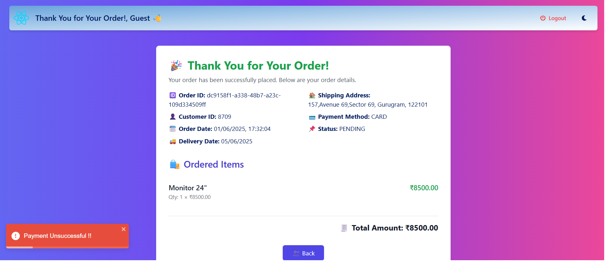

# E-commerce Microservices Application

## Overview

This is a full-stack e-commerce application built using a microservices architecture. The frontend is developed with **React** and **TypeScript**, while the backend is powered by **Spring Boot 4.0.0**. The app offers a smooth shopping experience with product listings, cart management, and payment integration.

## Features

- User-friendly UI with React and TypeScript
- Dynamic product display from the backend database
- User authentication (JWT planned for future)
- Shopping cart with add/remove item functionality
- Order checkout with billing details
- Integrated Razorpay payment gateway (test mode)
- Order status tracking and Toastr notifications for payment feedback

## Screenshots

<!-- ### Welcome Page -->
<!--  -->

### Login Page



### Product Landing Page



### Checkout Page



### Razor Pay Payment Page



### Thank You / Order Details Page



## Technologies Used

- Frontend: React, TypeScript, HTML, CSS, vite
- Backend: Spring Boot 4.0.0
- Database: SQL (currently local, planned for GCP)
- Payment Gateway: Razorpay (Test mode)
- Notifications: Toastr

## Future Improvements

- Implement JWT authentication
- Host backend and database on Google Cloud Platform (GCP)
- Complete payment success workflow with inventory updates
- Add user order history and tracking section

## Setup and Running

1. Clone the repository
2. Install frontend dependencies:
   ```bash
   cd INTERACTION-APP
   npm install
   npm run dev
   ```
